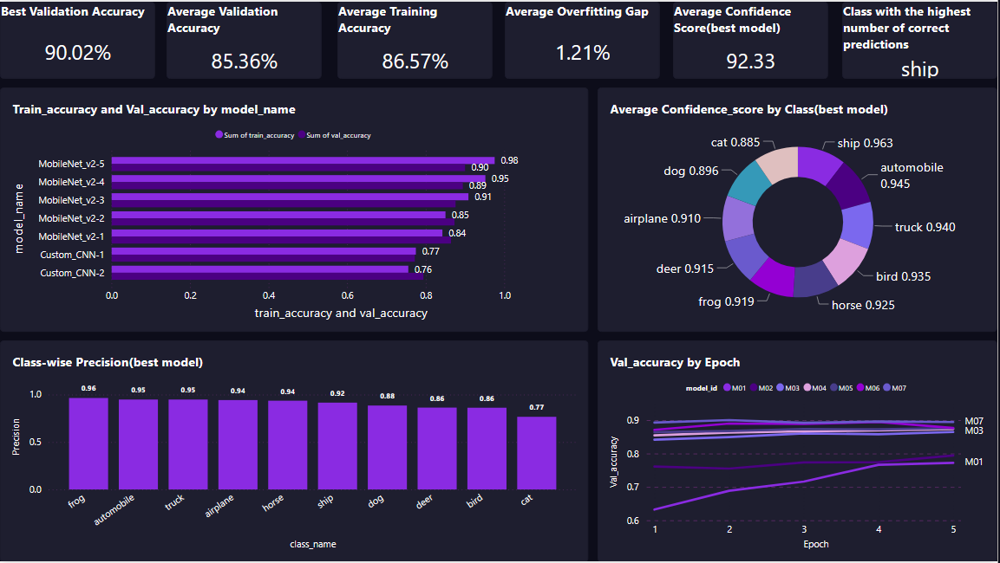

# CIFAR-10 Image Classification Project  

This project walks through a **complete end-to-end machine learning workflow** built around the **CIFAR-10 image dataset**.  

It covers everything from **data preparation and model training** to **experiment logging in SQL** and **interactive visualization in Power BI**.  
The goal is to show how I approach ML projects from both a **technical** and **real-world** perspective — building something accurate, structured, and explainable.  

---

---

## Project Structure  

```
CIFAR10-Project
│
├── Sample Data
│   ├── Class_Metrics
│   ├── Confusion_Matrix
│   ├── Epoch_Stats
│   ├── Model_Info
│   └── Predictions_Log
│
├── Notebooks
│   ├── Libraries.ipynb               # Library imports
│   ├── Data Preparation.ipynb        # Data loading, normalization, augmentation
│   ├── Training.ipynb                # Custom CNN + Transfer Learning (MobileNetV2)
│   ├── Metrics.ipynb                 # Evaluation and visualization
│   ├── SQL_Logging.ipynb             # Logs model metrics to SQL
│
├── SQL
│   └── create_tables.sql             # Script to create 5 SQL tables
│
├── CIFAR10-report.pbix               # Power BI dashboard
├── Dashboard.png                     # Dashboard preview
└── README.md
```

---

---

## Overview  

The **CIFAR-10** dataset contains 60,000 color images (32×32 px) across 10 object classes.  

In this project, I:  
1. Trained two models — a **custom CNN** and a **transfer learning model (MobileNetV2)**.  
2. Used **data augmentation** to improve generalization and reduce overfitting.  
3. Logged all training runs and metrics into a **SQL database**.  
4. Built a **Power BI dashboard** to visualize and compare results.  

The focus was to demonstrate how a machine learning pipeline can be built and tracked end-to-end, not just model performance.

---

---

## SQL Database Design  

Five SQL tables were designed to store model training and evaluation data:

| Table | Description |
|-------|--------------|
| **Model_Info** | Stores model name, training date, and overall performance. |
| **Epoch_Stats** | Tracks epoch-level loss and accuracy metrics. |
| **Class_Metrics** | Precision, recall, F1-score, and support for each class. |
| **Confusion_Matrix** | True vs predicted counts for misclassification analysis. |
| **Predictions_Log** | Each image’s prediction and whether it was correct. |

This structure makes experiment tracking efficient and reproducible, similar to **MLOps experiment logging**.

---

---

## Power BI Dashboard  

The **Power BI dashboard** visualizes model insights in an interactive and business-friendly way.  

Key visuals include:  
- **KPI Cards** — best accuracy, training summary, and model stats.  
- **Trend Charts** — training and validation accuracy/loss by epoch.  
- **Class Metrics** — per-class F1, precision, and recall.  
- **Confusion Matrix Heatmap** — to identify where models struggle.  
- **Model Comparison** — comparing custom CNN vs MobileNetV2.  

**Dashboard Preview:**  


---

---

##  Model Development  

###  Data Preparation & Augmentation  
All CIFAR-10 images were normalized and augmented using:  
- Random horizontal flips  
- Small rotations  
- Zoom and shift transformations  

This improved robustness and reduced overfitting by roughly **2–3%**.

---

### 🔹 Model Architectures  

**Custom CNN**  
- Three convolutional blocks with BatchNorm and Dropout  
- Adam optimizer with learning rate scheduling  
- Early stopping to prevent overfitting
- Model checkpoint to save the model with the best performing parameters 

**Transfer Learning (MobileNetV2)**  
- Pretrained on ImageNet  
- Initially froze base layers, then unfroze all but last 30 layers for fine tuning  
- Used callbacks like `EarlyStopping` and `ReduceLROnPlateau`  

Transfer learning significantly boosted validation accuracy and model stability.

---

###  Optimization & Tracking  
- **Data augmentation** to increase diversity  
- **EarlyStopping** to avoid unnecessary epochs  
- **Learning rate scheduling** for smooth convergence  
- **SQL logging** for transparent experiment history  
- **Power BI dashboard** for visual model comparison  

---

---

##  Results Summary  

| Metric | Custom CNN | Transfer Learning |
| ------- | ----------- | ---------------- |
| Train Accuracy | 92% | 95% |
| Validation Accuracy | 83% | **90%** |
| Overfitting Gap | 9% | **1%** |
| Best Epoch | 24 | 17 |

**Highlights:**  
- Transfer learning achieved higher validation accuracy with minimal overfitting.  
- Data augmentation improved class balance and performance stability.  
- Dog–Cat and Truck–Automobile classes had the highest confusion rates.  

---

---

##  Tech Stack  

| Category | Tools Used |
|-----------|------------|
| **Programming** | Python, Jupyter Notebook |
| **Libraries** | TensorFlow, Keras, scikit-learn, NumPy, Pandas |
| **Database** | SQL Server |
| **Visualization** | Power BI |
| **Dataset** | CIFAR-10 |

---

---

## Purpose of this project 

This project reflects how I like to approach machine learning — with structure, clarity, and explainability.  

It shows skills across:  
- **Model building** and **fine-tuning**  
- **Data engineering and SQL-based experiment tracking**  
- **Insight visualization in Power BI**  
- **Reproducible workflows** similar to production-level MLOps setups  

---

---

##  Author  

**Ricky Samson**  
Aspiring Data Scientist | Machine Learning Enthusiast  
🔗 [LinkedIn: www.linkedin.com/in/ricky-samson-aa6569331]

---
